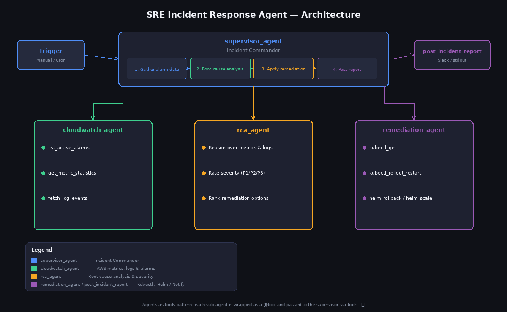

# SRE Incident Response Agent

An automated SRE incident response system that detects Amazon CloudWatch alarms, performs AI-powered root cause analysis, applies Kubernetes/Helm remediations, and posts structured incident reports to Slack.

## Overview

### Sample Details

| Information | Details |
|---|---|
| **Agent Architecture** | Multi-agent (agents-as-tools) |
| **Native Tools** | None |
| **Custom Tools** | `list_active_alarms`, `get_metric_statistics`, `fetch_log_events`, `kubectl_get`, `kubectl_rollout_restart`, `helm_rollback`, `helm_scale`, `post_incident_report` |
| **MCP Servers** | None |
| **Use Case Vertical** | DevOps / Site Reliability Engineering |
| **Complexity** | Advanced |
| **Model Provider** | Amazon Bedrock |
| **SDK Used** | Strands Agents SDK, boto3 |

### Architecture



Each specialist sub-agent is wrapped as a `@tool` function and passed to the supervisor via `tools=` (agents-as-tools pattern). The supervisor acts as Incident Commander, calling each sub-agent in sequence and synthesising their output into a final report.

### Key Features

- **Automatic alarm discovery** — polls all active Amazon CloudWatch alarms; optionally filters by namespace
- **AI-powered RCA** — reasoning-based root cause analysis with P1/P2/P3 severity scoring and ranked remediation options
- **Safe by default** — all `kubectl` and `helm` commands run in dry-run mode (`DRY_RUN=true`) until explicitly enabled
- **Flexible notification** — posts structured incident reports to a Slack webhook or prints to stdout
- **OpenShift compatible** — swap `kubectl` for `oc` in the remediation tools

## Prerequisites

- Python 3.11+
- AWS CLI configured with appropriate credentials (`aws configure` or IAM role)
- [Model access](https://docs.aws.amazon.com/bedrock/latest/userguide/model-access.html) enabled for Claude Sonnet 4 in Amazon Bedrock in your AWS region
- `kubectl` configured against your cluster (only required when `DRY_RUN=false`)
- `helm` v3 installed (only required when `DRY_RUN=false`)

### IAM permissions required

```json
{
  "Version": "2012-10-17",
  "Statement": [
    {
      "Effect": "Allow",
      "Action": [
        "cloudwatch:DescribeAlarms",
        "cloudwatch:GetMetricStatistics",
        "logs:FilterLogEvents",
        "logs:DescribeLogGroups"
      ],
      "Resource": "*"
    }
  ]
}
```

### Kubernetes RBAC permissions required (`DRY_RUN=false` only)

In dry-run mode no cluster access is needed. When `DRY_RUN=false` the remediation tools run live `kubectl` and `helm` commands. Create a namespaced `Role` (not `ClusterRole`) scoped to the namespaces the agent may act on:

```yaml
apiVersion: rbac.authorization.k8s.io/v1
kind: Role
metadata:
  name: sre-agent
  namespace: <target-namespace>
rules:
  - apiGroups: ["apps"]
    resources: ["deployments"]
    verbs: ["get", "list", "patch", "update"]
  - apiGroups: ["apps"]
    resources: ["replicasets"]
    verbs: ["get", "list", "watch"]
  - apiGroups: [""]
    resources: ["pods"]
    verbs: ["get", "list"]
  - apiGroups: ["autoscaling"]
    resources: ["horizontalpodautoscalers"]
    verbs: ["get", "list"]
  # Required by Helm to read and write release history
  - apiGroups: [""]
    resources: ["secrets", "configmaps"]
    verbs: ["get", "list", "create", "update", "delete"]
```

The table below maps each remediation tool to the permissions it needs:

| Tool | Command | Resources | Verbs |
|---|---|---|---|
| `kubectl_get` | `kubectl get <resource> -n <ns>` | `pods`, `deployments`, `replicasets`, `hpa` | `get`, `list` |
| `kubectl_rollout_restart` | `kubectl rollout restart deployment/<name>` | `deployments`, `replicasets` | `get`, `patch`, `list`, `watch` |
| `helm_rollback` | `helm rollback <release>` | `secrets`, `configmaps` (Helm release history) + chart-managed resources | `get`, `list`, `create`, `update`, `delete` |
| `helm_scale` | `kubectl scale deployment/<name> --replicas=N` | `deployments` | `get`, `patch`, `update` |

> **Note:** `helm rollback` re-applies the previous chart revision, so it also needs permissions over whatever resources your Helm chart manages (e.g. `services`, additional `configmaps`). Audit your chart's templates and extend the `Role` accordingly.

## Setup

1. Configure environment variables:

```bash
cp .env.example .env
# Edit .env with your configuration
```

2. Install dependencies:

```bash
pip install -r requirements.txt
```

## Usage

Run with automatic alarm discovery:

```bash
python sre_agent.py
```

Run with a specific trigger for faster focus:

```bash
python sre_agent.py "High CPU alarm fired on ECS service my-api in prod namespace"
```

### Example output

```
Starting SRE Incident Response
Trigger: High CPU alarm fired on ECS service my-api in prod namespace

[cloudwatch_agent] Fetching active alarms...
  ✓ Found alarm: my-api-HighCPU (CPUUtilization > 85% for 5m)
  ✓ Metric stats: avg 91.3%, max 97.8% over last 30 min
  ✓ Log events: 14 OOMKilled events in /ecs/my-api

[rca_agent] Performing root cause analysis...
  Root cause: Memory leak causing CPU spike as GC thrashes
  Severity: P2 — single service, <5% of users affected
  Recommended fix: Rolling restart to clear heap; monitor for recurrence

[remediation_agent] Applying remediation...
  [DRY-RUN] kubectl rollout restart deployment/my-api -n prod

======================================================================
*[P2] SRE Incident Report — 2025-10-14 09:31 UTC*

**What happened:** CloudWatch alarm `my-api-HighCPU` fired at 09:18 UTC.
**Root cause:** Memory leak in application heap leading to aggressive GC.
**Remediation:** Rolling restart of `deployment/my-api` in namespace `prod`.
**Follow-up:** Monitor CPUUtilization for 30 min; review recent commits.
======================================================================
```

## Flow Overview

1. **supervisor_agent** receives a trigger (manual or automated)
2. Calls **cloudwatch_agent** → fetches active alarms, metric statistics, and error logs
3. Calls **rca_agent** with the gathered data → returns root cause, severity rating, and ranked fixes
4. Calls **remediation_agent** with the RCA findings → inspects workloads and applies the safest action
5. Calls **post_incident_report** → posts the structured report to Slack or stdout

## Cleanup

No infrastructure is provisioned by this sample. To clean up, deactivate the virtual environment and delete the cloned directory.

## Troubleshooting

| Symptom | Likely Cause | Fix |
|---|---|---|
| `No active alarms found` when alarms exist | Namespace filter mismatch | Pass the exact Amazon CloudWatch namespace string, e.g. `AWS/ECS` |
| `ResourceNotFoundException` on log fetch | Wrong log group name | Verify the log group name in the Amazon CloudWatch console |
| `kubectl` commands fail | Cluster not configured | Run `kubectl config current-context` and confirm the correct cluster is active |
| Amazon Bedrock `AccessDeniedException` | Model access not enabled | Enable Claude Sonnet 4 access in the Amazon Bedrock console |
| `.env` values not picked up | Missing `python-dotenv` | Ensure `pip install -r requirements.txt` completed successfully |

## Additional Resources

- [Strands Agents SDK documentation](https://strandsagents.com)
- [Agents-as-tools pattern](https://strandsagents.com/latest/docs/user-guide/concepts/multi-agent/agents-as-tools/)
- [Amazon CloudWatch DescribeAlarms API reference](https://docs.aws.amazon.com/AmazonCloudWatch/latest/APIReference/API_DescribeAlarms.html)

---

> **Disclaimer:** This sample is provided for educational and demonstration purposes only. It is not intended for production use without further development, testing, and hardening. Set `DRY_RUN=false` only after thorough validation in a non-production environment. Always apply least-privilege IAM and Kubernetes RBAC policies.
