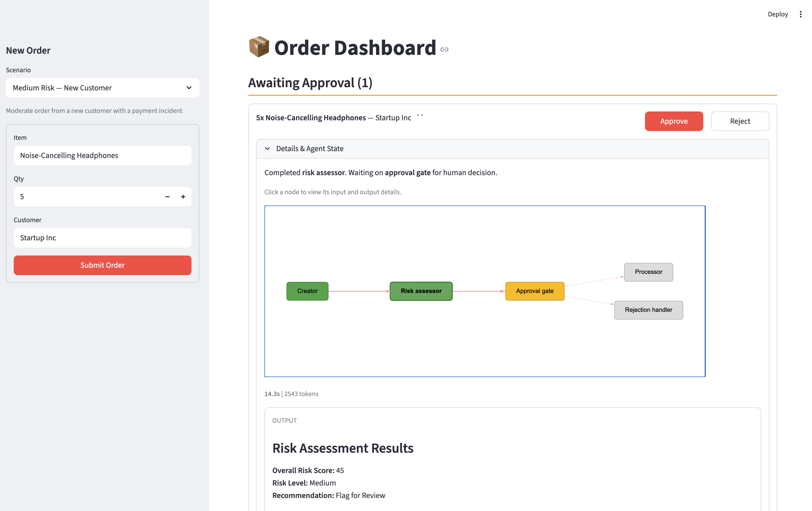
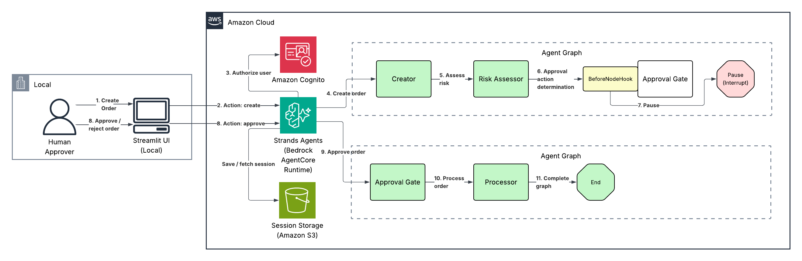

# Order Approval Agent with Human-in-the-Loop

An order approval system that demonstrates human-in-the-loop workflows using Strands Agents' interrupt/resume pattern. A multi-agent graph evaluates incoming orders — assessing risk factors like customer history, order value, and inventory levels — then pauses execution to let a human approver make the final call. The Streamlit UI provides an interactive dashboard where approvers can review AI-generated risk assessments, inspect each agent's reasoning by clicking through the workflow graph, and approve or reject orders in real time.



## Overview

### Sample Details

| Information | Details |
|---|---|
| Agent Architecture | Multi-agent (Graph) |
| Use Case Vertical | Retail / E-Commerce |
| Complexity | Advanced |
| Model Provider | Amazon Bedrock |
| SDK Used | Strands Agents SDK, AWS CDK |

### Architecture

The system uses a five-node agent graph deployed to AgentCore Runtime, with a Streamlit UI running locally as the human approval interface.

**Agent Graph Flow:**

1. **Creator** — Looks up products in the catalog, validates inventory, and structures the order with line items, pricing, and totals.
2. **Risk Assessor** — Scores the order across five risk factors (order value, customer newness, customer tier, payment history, inventory strain) producing a 0-100 risk score.
3. **Approval Gate** — A `BeforeNodeHook` checks the risk score. Orders scoring 30 or below are auto-approved. Higher-risk orders trigger a Strands `interrupt`, pausing the graph and returning control to the UI for human review.
4. **Processor** (on approval) — Places the order, decrements inventory, and generates a confirmation with estimated delivery.
5. **Rejection Handler** (on rejection) — Acknowledges the rejection and suggests next steps for the customer.

Session state is persisted in S3 via `S3SessionManager`, enabling the interrupt/resume cycle across stateless HTTP calls.



### Demo Scenarios

The UI includes pre-configured scenarios that exercise different branches of the approval logic:

| Scenario | Item | Customer | What It Demonstrates |
|---|---|---|---|
| **Low Risk — Trusted Customer** | 2x Wireless Keyboard | Acme Corp (Gold tier) | Auto-approval path — low value order from an established customer bypasses human review entirely |
| **Medium Risk — New Customer** | 5x Noise-Cancelling Headphones | Startup Inc (Standard tier) | Human review triggered — new customer with a payment incident pushes the risk score above the auto-approve threshold |
| **High Risk — Unknown Customer** | 4x Motorized Standing Desk | Unknown LLC (not in DB) | High risk score from unknown customer + high order value + inventory strain on a limited-stock item |
| **Inventory Strain — Bulk Order** | 10x Standing Desk Chair | MegaCorp LLC (Platinum tier) | Even a trusted platinum customer triggers review when ordering most of the available stock |
| **Custom Order** | (user-defined) | (user-defined) | Free-form entry to test any combination of products, quantities, and customers |

### Key Features

- Strands Agents interrupt/resume pattern for human-in-the-loop workflows
- Multi-agent graph with conditional branching (approve vs. reject paths)
- Risk scoring engine with five weighted factors and configurable auto-approve threshold
- Interactive workflow graph (streamlit-agraph) — click any node to inspect its output
- Deployed to Amazon Bedrock AgentCore Runtime via CDK with IAM authentication
- S3-backed session persistence across stateless invocations

## Prerequisites

- Python 3.13+
- [uv](https://docs.astral.sh/uv/) for dependency management
- [AWS CDK v2](https://docs.aws.amazon.com/cdk/v2/guide/getting_started.html) (`npm install -g aws-cdk`)
- AWS CLI configured with credentials that have permissions to deploy CDK stacks
- Amazon Bedrock model access enabled for `us.amazon.nova-pro-v1:0` (or your preferred model) in your region
- Docker (for building the AgentCore Runtime container image)

## Setup

### 1. Deploy Infrastructure

```bash
cd infrastructure
./deploy.sh
```

This deploys the CDK stack and writes outputs to `cdk-outputs.json`. The stack creates:
- AgentCore Runtime (builds and pushes the Docker image from `src/`)
- S3 bucket for session state

### 2. Configure the Streamlit Environment

```bash
cd streamlit_app
./configure_env.sh
uv sync
```

This generates a populated `streamlit_app/.env` from `cdk-outputs.json` automatically — no manual copy-pasting required.

## Usage

```bash
uv run streamlit run app.py
```

Open [http://localhost:8501](http://localhost:8501) in your browser.

### Flow Overview

1. Select a scenario (or create a custom order) in the sidebar and click **Submit Order**.
2. The agent graph runs — the Creator structures the order, the Risk Assessor scores it.
3. If the risk score exceeds the threshold, the graph pauses and the order appears under **Pending Approvals**.
4. Click nodes in the workflow graph to inspect each agent's reasoning and output.
5. Click **Approve** or **Reject** to resume the graph.
6. The Processor or Rejection Handler completes the workflow and the order moves to **Completed**.
7. Low-risk orders skip the approval step entirely and appear directly under **Completed** as auto-approved.

### Local Development (No AgentCore)

To test the agent locally without deploying to AgentCore Runtime:

```bash
cd src
./configure_env.sh   # generates .env from cdk-outputs.json
uv sync
uv run python -m main   # starts local server on :8080
```

Then in `streamlit_app/.env`, uncomment the local dev lines:

```
LOCAL_MODE=true
LOCAL_AGENT_URL=http://localhost:8080/invocations
```

## Project Structure

| Component | Path | Description |
|---|---|---|
| Agent graph | `src/main.py` | Multi-agent graph with interrupt hook, deployed to AgentCore Runtime |
| Agent tools | `src/tools.py` | Product lookup, risk assessment, and order placement tools |
| Product/customer data | `src/data.py` | In-memory product catalog and customer database |
| Container | `src/Dockerfile` | ARM64 image for AgentCore Runtime |
| Agent env config | `src/configure_env.sh` | Generate src/.env for local development from cdk-outputs.json |
| Streamlit UI | `streamlit_app/app.py` | Local UI for order creation, approval, and agent state inspection |
| CDK stack | `infrastructure/stack.py` | AgentCore Runtime, S3 |
| Deploy script | `infrastructure/deploy.sh` | One-command CDK deploy |
| Env config script | `streamlit_app/configure_env.sh` | Generate streamlit_app/.env from cdk-outputs.json |
| Cleanup script | `infrastructure/cleanup.sh` | Tear down all resources |

## Cleanup

```bash
cd infrastructure
./cleanup.sh
```

This destroys the CDK stack including the AgentCore Runtime and S3 bucket (and all session data).

## Troubleshooting

| Symptom | Likely Cause | Fix |
|---|---|---|
| Order stuck in pending | Agent invocation error | Check AgentCore Runtime logs in CloudWatch |
| `401 Unauthorized` from AgentCore | Missing or expired AWS credentials | Check your AWS CLI credentials (`aws sts get-caller-identity`) |
| Docker build fails | Docker not running | Start Docker Desktop |

## Additional Resources

- [Strands Agents SDK](https://strandsagents.com/)
- [Strands Agents — Multi-Agent Graphs](https://strandsagents.com/latest/user-guide/concepts/multi-agent/graph/)
- [Strands Agents — Interrupts](https://strandsagents.com/docs/user-guide/concepts/interrupts/)
- [Amazon Bedrock AgentCore Runtime](https://docs.aws.amazon.com/bedrock-agentcore/latest/devguide/runtime.html)
- [AWS CDK v2 Python](https://docs.aws.amazon.com/cdk/v2/guide/work-with-cdk-python.html)

## Disclaimer

This sample is provided for educational and demonstration purposes only. It is not intended for production use without further development, testing, and hardening.

For production deployments, consider:
- Implementing appropriate content filtering and safety measures
- Following security best practices for your deployment environment
- Conducting thorough testing and validation
- Reviewing and adjusting configurations for your specific requirements
